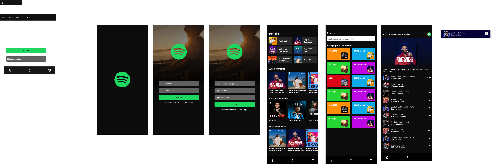

# ux-ui-portifolio
Repositório destinado aos estudos e projetos práticos da área de experiência do usuário. É fundamental que o desenvolvedor saiba entender o ponto de vista do usuário, afinal, os sistemas são construídos para eles usarem e isso deve ser levado em consideração. Os resultados de um aplicativo, sistema ou produto tem relação direta com a facilidade e satisfação do usuário em utilizá-los. Neglienciar esse tema tão importante pode levar a custos graves de dinheiro e tempo para uma empresa, assim corroborando com o que foi falado anteriormente. Diante disso, essa questão pode ser evitada tendo uma equipe focada em todos os aspectos envolvidos da interação do usuário com a interface. 

## Projetos Pessoais

<b>EP da Matéria IHC - ACH2005 <b>

## Projetos de Cursos

<b>Projeto Spotify<b>

